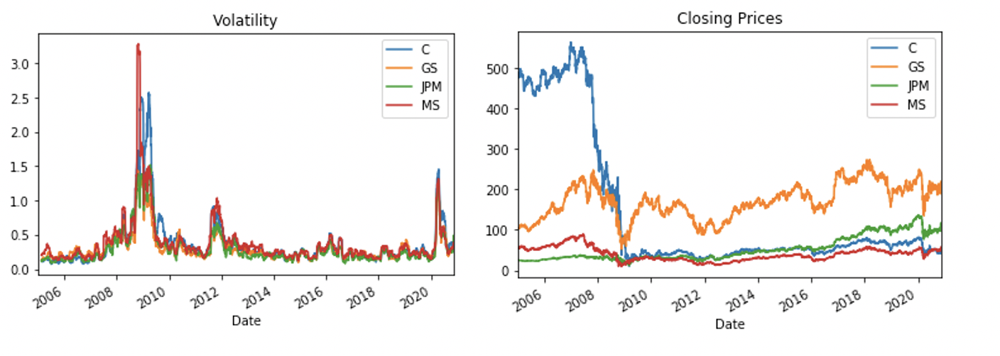

## Portfolio Rebalancing Techniques

### Introduction

Modern Portfolio Theory is the cornerstone of portfolio risk management, because the efficient frontier is a standard method of assessing both investor risk tolerance and market risk-return tradeoffs. To compute the efficient frontier, both expected returns and the covariance matrix of the portfolio are required. Portfolio optimization relies upon an unbiased and efficient estimate of asset covariance.
This project uses two models - ARIMA and Neural Networks to predict stock prices and assign weights for an optimal portfolio optimization. This experiment also accounts for the economic crisis of 2007-2009 and the current COVID pandemic. The aim is to create a portfolio with lowest possible volatility. 

### Data

Data has been sourced from Yahoo Finance, Consumer Finance and Coronavirus Source Data. Daily Stock prices for financial services firms – Citigroup, JP Morgan, Morgan Stanley and Goldman Sacs from 2005 to present has been extracted from Yahoo finance. To study of effect of the 2008 housing crisis, delinquency data from Consumer Finance is used. Also, data about COVID-19 (starting March 2020) is also being used.

### Methodology and Results

Initial analysis of the data

1.	Volatility in stocks: Volatility is the degree of variation of trading prices over-time. We can see that there is a spike in volatility between 2008 to 2009 and in the early months of 2020. 

